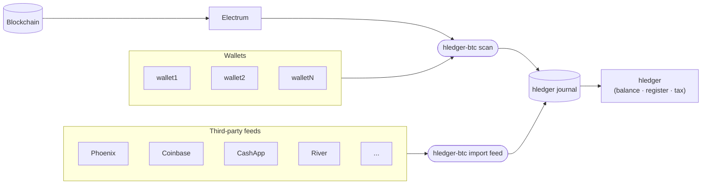

# hledger-btc

A Bitcoin accounting add-on for [hledger](https://hledger.org), written in Rust.

Bitcoin is the public ledger. Hledger is your personal ledger. `hledger-btc` bridges the two. It
scans the blockchain for your transactions, reads external feeds, merges entries that describe the
same transaction across sources (transfer matching), and writes the results as
double-entry journal entries — helping you track cost-basis, balances, cash
flows, etc.



## Features

- **`scan`** — scan wallets via Electrum and append new journal entries
- **`import feed <name>`** — import from a configured external feed (CSV, API) and append new entries; merges with on-chain data where transactions overlap
- **`import labels [file]`** — apply a [BIP329](https://github.com/bitcoin/bips/blob/master/bip-0329.mediawiki) label file to the journal
- **`label`** — set the description or posting note on a transaction, address, or output/input
- **`tag`** — attach hledger tags (`key:value`) to a transaction, address, or output/input
- **`export`** — export your journal to BIP329 label format
- **`receive`** — record a receiving address as a receivable in the journal
- **`config`** — manage the electrum server, wallet, and feed configuration
- **`trace`** — recursively print transactions associated with an address to trace its history

## Usage

```bash
# Scan the blockchain for transactions
hledger-btc scan

# Import from a configured third-party feed
hledger-btc import feed phoenix

# Import BIP329 labels into your journal
hledger-btc import labels labels.jsonl
hledger-btc import labels              # reads stdin

# Export journal to BIP329 (stdout, or -o for a file)
hledger-btc export -o labels.jsonl

# Label a transaction (sets the description field)
hledger-btc label tx <txid> "from Alice, for Coffee"

hledger-btc tag tx <txid> lot=20260608
hledger-btc tag tx <txid> kyc=false

# Label an output or input (sets the posting free-text comment)
hledger-btc label output <txid>:<vout> "savings deposit"
hledger-btc label input <txid>:<index> "spending from savings"
hledger-btc label addr <address> "cold storage"

# Tag a transaction or posting with key:value data
hledger-btc tag output <txid>:<vout> lot=20260608 cost=45000
hledger-btc tag addr <address> lot=20260608

# Record an expected incoming payment
hledger-btc receive --address bc1q... --description "Invoice 3" --amount 100000 --total-cost 'USD 500.00'

# Trace the visibility footprint of an address
hledger-btc trace bc1q...

# Config management
hledger-btc config path
hledger-btc config show
hledger-btc config set --network bitcoin --server-url ssl://electrum.blockstream.info:50002
hledger-btc config wallet add --name savings --descriptor "wpkh([df9d4f28/84h/0h/0h]xpub.../0/*)"
hledger-btc config wallet remove --name savings
hledger-btc config feed list
```

### Journal file resolution

All commands that read or write a journal use this fallback chain, mirroring hledger:

1. `-f`/`--file` argument
2. `LEDGER_FILE` environment variable
3. `~/.hledger.journal`

`scan` also accepts `-o`/`--output` to write new entries to a different file than the one used for dedup (useful for year-split journal setups).

## Installation

From source:

```bash
git clone https://github.com/brh28/hledger-btc
cd hledger-btc
cargo install --path crates/hledger-btc
```

The default install supports `scan`, `import labels`, `label`, `tag`, `export`, `receive`, `trace`, and `config`. Feed providers are opt-in via feature flags:

```bash
# Install with specific feed providers
cargo install --path crates/hledger-btc --features phoenix,river

# Install with all feed providers
cargo install --path crates/hledger-btc --features phoenix,coinbase,cashapp,river
```

| Feature | Provider |
|---|---|
| `phoenix` | Phoenix wallet CSV export |
| `coinbase` | Coinbase API |
| `cashapp` | Cash App CSV export |
| `river` | River "Account Activity" CSV export |

## Configuration

Config lives at `~/.config/hledger-btc/config.toml`.

```toml
# base_account = "assets:bitcoin"   # optional, default: assets

[scan]
network    = "bitcoin"               # bitcoin | testnet | signet | regtest
server_url = "ssl://electrum.blockstream.info:50002"
# client_type = "electrum"          # optional, default: electrum

[[wallets]]
name           = "savings"
ext_descriptor = "wpkh([df9d4f28/84h/0h/0h]xpub.../0/*)"
# int_descriptor is optional — derived from ext_descriptor if omitted

[[wallets]]
name           = "spending"
ext_descriptor = "wpkh([ab1c2d3e/84h/0h/0h]xpub.../0/*)"

[[feeds]]
name     = "phoenix"
provider = "phoenix"
path     = "/home/me/sync/phoenix-export.csv"
```

`base_account` is the account prefix for all wallet and `receive` postings. Each
wallet's account is `<base_account>:<name>`, e.g. `assets:bitcoin:savings`.

### Feeds

Each `[[feeds]]` entry defines an external data source imported with `hledger-btc import feed <name>`:

- `name` — unique identifier; used as the `source:` stamp on journal entries and as the account suffix
- `provider` — which parser to use (see table below)
- remaining fields are provider-specific (e.g. `path`, `api_key`)

Entries from different feeds that share a `txid` or `payment_hash` — for example, an on-chain transaction and a Lightning swap-in — are merged into a single journal entry. If a feed reports data for a transaction already in the journal, `import feed` skips it and prints a notice.

Supported providers:

| Provider | Format | Account | Notes |
|---|---|---|---|
| `phoenix` | Phoenix wallet CSV export | `<base_account>:<name>` | |
| `coinbase` | Coinbase API | `<base_account>:<name>` | |
| `cashapp` | Cash App CSV export | `<base_account>:<name>:btc`, `<base_account>:<name>:usd` | Reconciliation not supported — Cash App export does not include txid or payment_hash |
| `river` | River "Account Activity" CSV export | `<base_account>:<name>` | Reconciliation not supported — River export does not include txid or payment_hash |

## Design

### Per-address sub-accounts

Each Bitcoin address becomes a sub-account under the wallet account (e.g.
`assets:bitcoin:savings:bc1q...`). This makes it possible to track which
address holds or spent funds, audit individual UTXOs, and produce accurate
per-address balance reports in hledger.

### sat accounting

All amounts are recorded in satoshis to avoid floating-point imprecision.

### Machine-managed fields

`scan` and `import feed` write structural tags that `label`, `tag`, `import labels`, and `export` depend on.
**Do not remove or rename these fields in the journal:**

| Field | Where | Purpose |
|---|---|---|
| `txid:` | transaction comment | links entries across commands and sources |
| `payment_hash:` | transaction comment | links Lightning entries across sources |
| `source:` | transaction comment | records which source(s) produced the entry; drives scan dedup |
| `vout:N` | output posting comment | identifies the transaction output (outpoint index) |
| `input:N` | input posting comment | identifies the transaction input being spent |
| address sub-account | posting account name | e.g. `assets:bitcoin:savings:bc1q...` |

Everything else — the description, posting free-text, and any user-defined tags — is safe to edit freely. Use `label` and `tag` commands rather than hand-editing to reduce the risk of accidentally modifying structural fields.

### Transfer matching

When two sources each see one side of the same transaction — for example,
Electrum recording an outgoing spend and Phoenix recording a swap-in with the
same `txid` — entries are merged into a single journal entry. Entries sharing a
`txid`, `payment_hash`, or provider-specific id (e.g. `coinbase_id`) across `scan` and `import feed` runs
are merged, with their postings combined and tags unioned.

### BIP329

[BIP329](https://github.com/bitcoin/bips/blob/master/bip-0329.mediawiki) is a
standard JSONL format for wallet labels. `import labels` annotates existing journal
entries with labels as hledger tags; `export` reads those tags back out.

All four BIP329 record types are supported:

| Type | Ref format | Maps to |
|---|---|---|
| `tx` | txid | transaction description |
| `addr` | address | posting free-text comment |
| `output` | txid:vout | output posting free-text comment |
| `input` | txid:index | input posting free-text comment |

Extra hledger tags (e.g. `lot:20260608`) are round-tripped via a non-spec
`tags` field that other BIP329 clients will safely ignore. Records with neither
a label nor tags are omitted from export.

## Project status

| Phase | Status | Description |
|---|---|---|
| 1 — Scaffold | ✅ | Workspace, CLI, config, logging |
| 2 — Scan | ✅ | Electrum scan, per-address postings, fee extraction |
| 3 — Receive | ✅ | Receivable journal entries |
| 4 — BIP329 Import | ✅ | BIP329 → hledger journal |
| 5 — BIP329 Export | ✅ | hledger journal → BIP329 |
| 6 — Label / Tag | ✅ | CLI commands for annotating transactions and postings |
| 7 — Trace | ✅ | Per-address visibility footprint |
| 8 — Tests | 🔲 | Integration tests against regtest |
| 9 — Polish | 🔲 | CI, crates.io publish |

## Dependencies

| Crate | Purpose |
|---|---|
| `bdk_wallet` | Descriptor parsing, address derivation, fee calculation |
| `bdk_electrum` | Electrum blockchain backend |
| `bdk_file_store` | Persistent wallet state (keychain index, UTXO graph) |
| `bip329` | BIP329 record types and JSONL serialization |
| `clap` | CLI argument parsing |
| `serde` + `toml` | Config serialization |
| `serde_json` | BIP329 JSONL serialization |
| `chrono` | Date formatting |
| `dirs` | Platform config directory |
| `anyhow` + `thiserror` | Error handling |
| `tracing` + `tracing-subscriber` | Structured logging |

## License

MIT OR Apache-2.0
